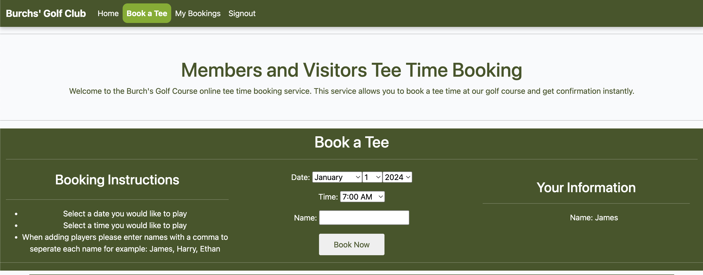

# PP4-Django-Project - Golf Booking System

## Site Introduction
I have created this golf booking system site as I play and enjoy golf myself. I like to create my projects around my own personal interests as I am able to put more into it and always want to add more features to improve it. The site is a place where users can book a tee time to play a round of golf, add players too, change the date/time and cancel bookings. The project utilites Django, Bootstrap, HTML Templates, CSS and Python code to allow the user to book a time, edit their booking, cancel their booking and upload scores to the leaderboard. The project has an admin account linked which can select what dates and times are available for users to book.

- Burch's Golf Club/Course does not actually exist it is made up using my surname for the purpose of this project.

## Project Planning
Prior to starting this project deciding what to base it on was hard as I had many options such as; restaurant booking system, car sale/buying site and a golf booking system/website for a golf club. I have always played golf and enjoyed it, other projects have been based on my other interests so I thought it was only right to carry on that theme. It really helps me when creating my projects to do this as I can share my love and passion for my interests through my work. I set out to begin deciding what needed to be on the site by drawing out a flow chart with a pen and paper to help me understand what I needed on/from my site. I then began to create my user stories/issues to really understand the needs of both the user and admin. The site needed to include a booking system which only allows a person to book if they have an account registered, a leaderboard for the users to upload their score, a 'profile' so that a user can sign in and manage their bookings and also view previous bookings. 

## User Experience (UX)

### User Needs
- The Burch's Golf Club website needs to allow a site user to create and account to make, manage and view their tee time bookings.
- It must be clear and easy to navigate.
- A site user must be able to find the address and map location of the golf course.
### Colour Scheme
- I decided to use a green/white colour scheme for this project as I think they compliment one another nicely. This creates a great user experience as everything is clear and easily readable. For an unknown reason when doing lighthouse tests on my home page it suggests the the white over the green background is not a good enough contrast, however, this issue does not appear when testing any other pages. I have also recieved many opinions from friends and family to query whether or not they think it is a good contrast and the general response is that the colours are clear against one another.
- I also decided to use green as it is a very fitting colour to use when considering that the site is used for booking a round of golf.

### Using Bootstrap
- I decided to import a basic bootstrap navbar from the bootstrap website then modify it to the needs of my site.

### Images
- All images used on this site are from google images and are random courses as Burch's Golf Course does not exist.

## Features
### Home Page
- The home page on this project has been kept simple as this is not the main focus of my project however it serves the purpose of welcoming site users giving them a welcome to the club/website and the course location/address.
- It has been made using bootstrap just like all of the HTML structure on this project, as a result it is fully responsive on all screen sizes utilising a collapsable navbar on smaller devices.

### Booking Page
- The booking page has a login_required attached to the views.py file to ensure that it can only display when an authenticated user is logged in, otherwise the user will be met with the signin page before being able to access the booking page.
- Once the user is signed in then the booking page is displayed, the user is then met with a nice image of the course with a small image with initial information about member and visitor booking.
- Below this, there is a booking form to be filled out alongisde booking instructions and 'your information' this just displays the signed in users account name as they do not require any other information to create an account for the purpose of this project. The booking form only requires the user to select a date and time to submit.

The above image shows the booking page when a user is logged in
- The booking page also has some information below the booking form for information such as green fees, buggy hire and the practise area so that users know what to expect upon arrival.

### My Bookings Page
- Once a user has submitted their booking form and it is successful they will then be redirected to the 'my bookings' page which will display any current or past bookings they have made. I have displayed the information in a table giving each booking its own row.

- The my bookings page has an 'edit/cancel' button attached at the end of each booking, this is linked to the edit booking page and my edit booking views.py code to allow a user when logged in to change anything about their booking and even delete/cancel it.

## Using Agile
- Requirements were captured as user stories as issues and put into my 'project' on github for tracking progress. They describe features from the end-user's perspective.
- The project was broken down into smaller, manageable iterations. I tried to not move onto the next part of the project until I was satisfied with the current part.
- Code was committed regularly to the repository ensuring that the project was always in a testable state.

## Testing

### Manual Testing Table

| What I am testing? | How I tested it| Expected Outcome | Result |
| -- | -- | -- | -- |
| Nav links work | Load the deployed project and click each link | Every link lands on the correct page | Pass |
| Social media links work | Load the deployed project and click each link | Every link lands on the correct page | Pass |
| There is no horizontal scroll | Load the deployed project and inspect (dev tools) check every page on different screen sizes | No horizontal scroll on any display or device | Pass |
| Signin/Signup allows a user to login or signup | Try to signin before creating an account then try to create an account and sign in after | Firstly it should not sign in and prompt to create an account then signin with them details | Pass |
| Booking form allows submit without adding players | Try to make a booking without adding players | Form should submit and booking appear in my booking page with extra players column empty | Pass |
| -- | -- | -- | -- |

## Bugs and Fixes

- I had a problem when making my django models for making a booking where once a user had filled out the booking form it was not saving properly to the database and creating the booking, this made me rethink and rewrite my code for the whole booking process to solve it. Once I had re written the code it was working how I wanted it too.

- There is currently a bug where the successfully signed in alert stays on the page creating an area of blank space between the booking page top image and the navbar that should not be there and it is not possible to scroll up and delete this alert

### Problems I Had
- Getting the 'book' submit button on the create_booking form view to work, I was able to create/add a booking in the admin view and have it display in the my bookings section when a user was logged in but not able to save a booking correctly when signed in on the 'book a tee' page. 

### Deployment
- For deploying this project their are many more steps to previous projects. I personally had some issues when trying to get my static files to work on my deployed project through heroku. I later found my issue after about 30-45 minutes of searching that I had not removed the 'collect_static' from my Config Vars on settings of my heroku app.

Steps for deployment:
- Debug must be set to FALSE in the settings.py file
1. Firstly to deploy a project you must create an app on heroku and link your github repository
2. Next add your config for your database URL and secret_key that is in your settings.py file of your django project. Also add a collect static config var which will later need removing.
3. To ready your code to deploy you must use pip3 to install gunicorn and whitenoise (freeze these to local - requirements.txt file), add a Procfile file and add heroku to the allowed hosts in settings.py.
4.  

Link to the live site : https://pp4-django-project-082841c8663e.herokuapp.com/

## Using Django
- Talk about how I decided to change my models completely and struggles with having to change all of the code that linked together to get it to the front end as I could not figure out how to get the bookings to post/save to the backend without use of the admin panel.
- Talk about how I then had to add an edit button to allow users to edit their booking

### Django Models
- I have a django model that I have created myself that allow an admin to select dates that are available for booking via the admin panel, once the dates have been added to the database any user is then able to see them on a drop down menu when creating a booking.
- I also have another django model created by myself which allows a user to select a time from 4 different time slots to create a booking, these bookings can be viewed when logged in.

### Django Views

## Future Enhancements

