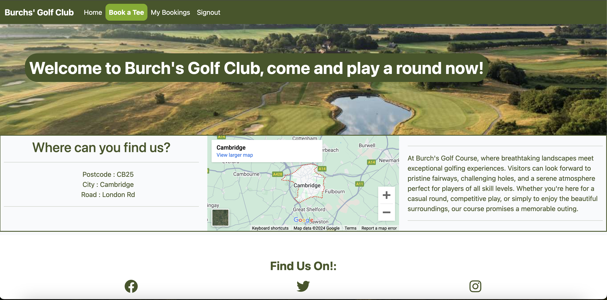
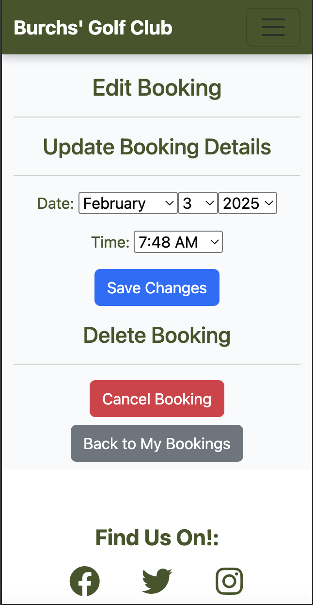

# PP4-Django-Project - Golf Booking System

## Site Introduction
I have created this golf booking system site as I play and enjoy golf myself. I like to create my projects around my own personal interests as I am able to put more into it and always want to add more features to improve it. The site is a place where users can book a tee time to play a round of golf, add players too, change the date/time and cancel bookings. The project utilites Django, Bootstrap, HTML Templates, CSS and Python code to allow the user to book a time, edit their booking and cancel their booking.

- Burch's Golf Club/Course does not actually exist it is made up using my surname for the purpose of this project.

## Project Planning
Prior to starting this project deciding what to base it on was hard as I had many options such as; restaurant booking system, car sale/buying site and a golf booking system/website for a golf club. I have always played golf and enjoyed it, other projects have been based on my other interests so I thought it was only right to carry on that theme. It really helps me when creating my projects to do this as I can share my love and passion for my interests through my work. I set out to begin deciding what needed to be on the site by drawing out a flow chart with a pen and paper to help me understand what I needed on/from my site. I then began to create my user stories/issues to really understand the needs of both the user and admin. The site needed to include a booking system which only allows a person to book if they have an account registered and signed in. When a user is signed in they must be able to manage their bookings and view bookings. 

## User Experience (UX)

### User Needs
- The Burch's Golf Club website needs to allow a site user to create an account.
- Be able to make a tee time booking adn then view their bookings
- Be able to edit and cancel any bookings they have made
- It must be clear and easy to navigate.
- A site user must be able to find the address and map location of the golf course.
### Colour Scheme
- I decided to use a green/white colour scheme for this project as I think they compliment one another nicely. This creates a great user experience as everything is clear and easily readable. The initial green that I used did not pass the accessibility lighthouse tests so I had to use the prompt to find a darker shade that did pass.
- I also decided to use green as it is a very fitting colour to use when considering that the site is used for booking a round of golf.

### Using Bootstrap
- I decided to import a basic bootstrap navbar from the bootstrap website then modify it to the needs of my site.

### Images
- All images used on this site are from google images and are random courses as Burch's Golf Course does not exist.

## Features
### Home Page
- The home page on this project has been kept simple as this is not the main focus of my project however it serves the purpose of welcoming site users giving them a welcome to the club/website and the course location/address.
- It has been made using bootstrap just like all of the HTML structure on this project, as a result it is fully responsive on all screen sizes utilising a collapsable navbar on smaller devices.

### Booking Page
- The booking page has a login_required attached to the views.py file to ensure that it can only display when an authenticated user is logged in, otherwise the user will be met with the signin page before being able to access the booking page.
- Once the user is signed in then the booking page is displayed, the user is then met with a nice image of the course with initial information about member and visitor booking.
- Below this, there is a booking form to be filled out alongisde booking instructions and 'your information' this just displays the signed in users account name as they do not require any other information to create an account for the purpose of this project. The booking form only requires the user to select a date and time to submit.

The above image shows the booking page when a user is logged in
- The booking page also has some information below the booking form for information such as green fees, buggy hire and the practise area so that users know what to expect upon arrival.

### My Bookings Page
- Once a user has submitted their booking form and it is successful they will then be redirected to the 'my bookings' page which will display any current or past bookings they have made. I have displayed the information in a table giving each booking its own row.

- The my bookings page has an 'edit/cancel' button attached at the end of each booking, this is linked to the edit booking page and my edit booking views.py code to allow a user when logged in to change anything about their booking and even delete/cancel it.

### Messages 
- The website has django messages built in so that whenever a user logs in or out they receive a message on screen to confirm that it has been successful.
It also has messages that come up if the form has an error and is not completed correctly prompting the user to try again, if they booking is successful the user will be redirected to my bookings and shown a successful booking message.
The messages are also linked to the edit/cancel booking page which will show to confirm the successfull changes or cancellation to a booking.

## Using Agile
- I do not believe that I have used agile entirely correctly throughout this project as I did not think to add smaller parts of the project like styling and bugs that I came into until my mentor suggested that I needed to add these things.
- Requirements were captured as user stories as issues and put into my 'project' on github for tracking progress. They describe features from the end-user's perspective.
- The project was broken down into smaller, manageable iterations. I tried to not move onto the next part of the project until I was satisfied with the current part. However, there were some things that I believed to be completed when in actual fact they were not, some of them had bugs or improvements that could be made which were highlighted to my by my mentor. I will remember to not progress anything into completed in the future until I am 100% sure it is complete.
- Code was committed regularly to the repository ensuring that the project was always in a testable state.

## Testing

### Manual Testing Table

| What I am testing? | How I tested it| Expected Outcome | Result |
| -- | -- | -- | -- |
| Nav links work | Load the deployed project and click each link | Every link lands on the correct page | Pass |
| Social media links work | Load the deployed project and click each link | Every link lands on the correct page | Pass |
| There is no horizontal scroll | Load the deployed project and inspect (dev tools) check every page on different screen sizes | No horizontal scroll on any display or device | Pass |
| Signin/Signup allows a user to login or signup | Try to signin before creating an account then try to create an account and sign in after | Firstly it should not sign in and prompt to create an account then signin with them details | Pass |
| Booking form allows submit without adding players | Try to make a booking without adding players | Form should submit and booking appear in my booking page with extra players column empty | Pass |
| Edit/Cancel button | Try to edit and save changes or delete a booking | Booking should update or delete | Pass |

### Code Validation and Lighthouse Tests

- I have used the Code Institute python code checker to make sure that my code is valid, here are the screenshots of the results from some files however all files have been checked:

Models.py file validation

Forms.py file validation

Urls.py file validation

Views.py file validation

- I have also validated all of my CSS using the CSS Validator

- I have also validated all of my HTML by passing the live URL to the deployed website through the HTML Validation, please note there was 1 error. I have looked into this error and have been unable to resolve however I have attached an image to show where the supposed error is as you can see there is a closing footer tag.

- Next will be all of the pages lighthouse scores

#### Home Page
This score is low because of the iframe importing the google map, I have not been able to find a fix for this.

#### Signin/up and Logout Pages
Signin

Signout

Signup

#### Booking Page

#### My Bookings Page

#### Edit Booking Page

## Bugs and Fixes

- I had an issue with the my bookings table on screen sizes that were smaller than 768px as the page was getting horizontal scroll from the table being too wide.
 - To fix this problem I used CSS styling to make the table have a scroll wheel when it can't fit fully on the screen without scrolling. This did cause some issues with the classes I had targetting the table to style it, however this was a quick fix and now is fully responsive.

- There was a bug where the booking form would only let you submit if you added a player into the Name: section of the form, this should not be the case, it should submit even if this field is left blank as players should be able to book for just themselves. 

- I had a problem when making my django models for making a booking where once a user had filled out the booking form it was not saving properly to the database and creating the booking, this made me rethink and rewrite my code for the whole booking process to solve it. Once I had re written the code it was working how I wanted it too.

- There was a bug where the successfully signed in alert stays on the page creating an area of blank space between the booking page top image and the navbar that should not be there and it is not possible to scroll up and delete this alert. This bug was fixed when I went back to add in the final messages for telling the user that they have successfully signed in or completed a form anywhere on the site.

### Problems I Had

- Getting the 'book' submit button on the create_booking form view to work, I was able to create/add a booking in the admin view and have it display in the my bookings section when a user was logged in but not able to save a booking correctly when signed in on the 'book a tee' page. 
 - To fix the above problem I decided to completely redo my models as they were not working as I had intended so personally I felt that it was easier to
begin to rewrite the models from scratch using different parts of the code that I already had written. This was a good decision as it allowed me to learn from
my mistakes from the previous models and get it right this time. I am very happy with how the final product turned out for the booking form as a result.

- When doing my final deploy for my project I had my secret key setup wrong and it was visible in the settings.py file, I moved this to a file that is in the gitignore. file so that it can not be accessed for security reasons, I had some issues with this as I did not import the secret key from the file it was in correctly. This lead to my site having an error which did not tell me the root cause of the issue even with debug = True. To resolve the issue I went back to the Code Institute walkthrough project to check through the deployment steps, I quickly realised where I had gone wrong and rectified this issue.

### Deployment
- For deploying this project their are many more steps to previous projects. I personally had some issues when trying to get my static files to work on my deployed project through heroku. I later found my issue after about 30-45 minutes of searching that I had not removed the 'collect_static' from my Config Vars on settings of my heroku app.

Steps for deployment:
- Debug must be set to FALSE in the settings.py file
1. Firstly to deploy a project you must create an app on heroku and link your github repository
2. Next add your config for your database URL and secret_key that is in your settings.py file of your django project. Also add a collect static config var which will later need removing.
3. To ready your code to deploy you must use pip3 to install gunicorn and whitenoise (freeze these to local - requirements.txt file), add a Procfile file and add heroku to the allowed hosts in settings.py.
4.  Once I had 

Link to the live site : https://pp4-django-project-082841c8663e.herokuapp.com/

## Using Django
- Talk about how I decided to change my models completely and struggles with having to change all of the code that linked together to get it to the front end as I could not figure out how to get the bookings to post/save to the backend without use of the admin panel.

- While creating my project I had written my intial models out which later caused some problems once I had a form to be filled out and post the data to the back end to be stored. The form was being filled out but nothing was being saved to the backend which was a big issue as this meant that there was no data to retrieve from the database to display in a users account for their bookings. I had spent a significant amount of time looking into this and changing small bits of code across the project to try and rectify this but nothing I did fixed this issue. I decided that it would be better to use the code I had written and rewrite my models but make sure that they were better and going to handle the form data correctly. This is now what my current models are that allow the site to work as it does.

- Once I had created the model to make a booking and the data was being stored correctly, I had already made my html template to display the booking data but there was no way to update or delete anything as a site user which is a big problem as this would not meet the requirements of the site goals or the project. I decided that I wanted to add a button to each individual button which meant that a user would be redirected to another page where they could either 'Cancel' or update anything to do with their booking such a just the time, day, year or month. I did this by writing a view that would overwrite the current booking information.
 - Initially I did try to have a feature that allowed a user to add extra players to a booking through this page however it was not working as I wanted and was causing issues which I did not have time to fix properly. This was removed as a result of not being needed and not working correctly.

## Future Enhancements

- One thing that I would add in the future is the feature that I had just talked about where a user can add an extra player/person onto the booking through the edit booking page. This would give the website a more real world feel as this is something that I often use myself when going for a round of golf to add a friend who has been able to join last minute.

- I would love to have added another model which allows users to share their scores from the round of golf they have played, it would have a leaderboard which all users when signed in can view to see who is ontop for that week/month or overall, it would have a filter where users could select if they wanted to see high/low scores of the week. 